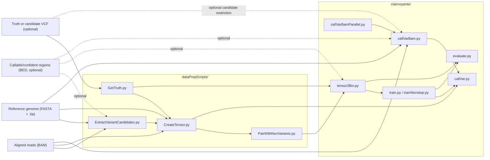

# Clairvoyante Documentation

This documentation set describes the current repository as implemented, not just the historical usage examples in the root README.

Clairvoyante is a deep-learning variant caller for aligned sequencing reads. In this codebase, the project is organized around two cooperating subsystems:

- `dataPrepScripts/`: generate candidate sites, truth labels, and tensors from BAM/VCF/reference inputs.
- `clairvoyante/`: define the neural network, train it, evaluate it, and call variants from prepared tensors or directly from BAM.

## Documentation Map

- [Architecture Overview](./architecture.md)
- [Data Flow and File Formats](./data-flow.md)
- [Model and Training](./model-and-training.md)
- [CLI and Script Reference](./cli-reference.md)
- [Operations and Limitations](./operations-and-limitations.md)

## At A Glance



## Core Execution Modes

### 1. Direct variant calling from BAM

The runtime pipeline is process-based:

```text
ExtractVariantCandidates.py | CreateTensor.py | callVar.py
```

`callVarBam.py` is the orchestrator for this path. It shells out to the two `pypy`-friendly preprocessing scripts and then launches the TensorFlow model runner in standard Python.

### 2. Model training from truth data

Training starts from truth VCF entries and candidate/non-variant tensors:

1. `GetTruth.py` extracts simplified truth records from a truth VCF.
2. `CreateTensor.py` turns truth locations into variant tensors.
3. `ExtractVariantCandidates.py --gen4Training` plus `CreateTensor.py` generate non-variant candidates.
4. `PairWithNonVariants.py` mixes truth-variant and sampled non-variant tensors.
5. `tensor2Bin.py` optionally converts the gzipped text tensors into a pickled, block-compressed binary dataset.
6. `train.py` trains the selected Clairvoyante network.

## Repository Shape

| Path | Role |
| --- | --- |
| `clairvoyante.py` | Top-level dispatcher for the main subcommands. |
| `port23.py` | One-time Python 2 to Python 3 conversion helper. |
| `clairvoyante/` | Network definitions, training, evaluation, visualization, and calling code. |
| `dataPrepScripts/` | Tensor generation and data preparation scripts, designed to run well under `pypy`. |
| `jupyter_nb/` | Demo and visualization notebooks. |
| `Dockerfile` | TensorFlow 1.12 based image with both CPython and PyPy installed. |

## Important Constraints

- The implementation is written for Python 2 and TensorFlow 1.x.
- Some scripts are explicitly optimized for `pypy`; TensorFlow-backed scripts are not.
- The code relies heavily on shelling out to `samtools`, `gzip`, and sometimes `tabix`.
- Many intermediate files are gzipped plain text streams rather than structured binary formats.

## Recommended Reading Order

1. [Architecture Overview](./architecture.md)
2. [Data Flow and File Formats](./data-flow.md)
3. [Model and Training](./model-and-training.md)
4. [CLI and Script Reference](./cli-reference.md)
5. [Operations and Limitations](./operations-and-limitations.md)
