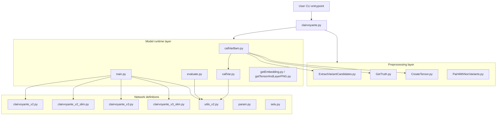
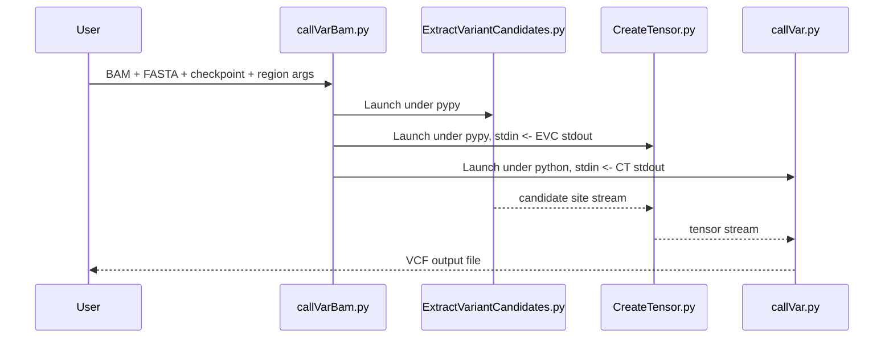

# Architecture Overview

## System Summary

Clairvoyante is a hybrid pipeline with:

- stream-oriented preprocessing scripts that inspect alignments and build local tensor summaries, and
- a TensorFlow 1 convolutional neural network that predicts multiple properties of a genomic site.

The design is intentionally split so that expensive alignment parsing can be done with `pypy`, while model execution stays in standard Python with TensorFlow.

## Top-Level Components

## Entry Points

### `clairvoyante.py`

This file is a submodule invoker. It maps the first CLI argument to a module under either:

- `clairvoyante/`
- `dataPrepScripts/`

When running under Python 3, it also prepends the package directory to `sys.path` so Python-2-style imports still resolve after conversion.

### `callVarBam.py`

This is the most operationally important entrypoint. It does not call model code directly. Instead, it assembles a three-process pipeline:

It also monitors child processes with a signal-based watchdog and terminates siblings if one stage fails.

### `callVarBamParallel.py`

This script does not do variant calling itself. It scans the reference index (`.fai`) and emits many `callVarBam.py` commands, one per chunked region, so external tools such as GNU Parallel can run them concurrently.

## Code Organization by Responsibility

### Data preparation

| Script | Responsibility |
| --- | --- |
| `ExtractVariantCandidates.py` | Scan BAM alignments, pile up counts, and emit candidate positions based on allele fraction and depth thresholds. |
| `GetTruth.py` | Simplify truth VCF entries into an internal whitespace-delimited truth format. |
| `CreateTensor.py` | Convert local alignment context around candidate positions into the tensor representation used by the model. |
| `PairWithNonVariants.py` | Combine truth-variant tensors with sampled non-variant tensors for supervised training. |

### Model runtime

| Script | Responsibility |
| --- | --- |
| `callVar.py` | Load a trained checkpoint, read tensors, run inference, and write VCF. |
| `train.py` | Train a network with adaptive learning-rate decay and validation monitoring. |
| `trainNonstop.py` | Train continuously while saving checkpoints every epoch. |
| `trainWithoutValidationNonstop.py` | Train on all input data without a validation split. |
| `evaluate.py` | Evaluate a checkpoint against labeled tensors. |
| `evaluateListOfModels.py` | Reuse one dataset to score multiple checkpoints. |

### Model definitions

The model variants live in separate files, but the surrounding infrastructure is shared:

- `param.py` defines shared hyperparameters and tensor dimensions.
- `utils_v2.py` loads and transforms tensors, labels, and compressed datasets.
- `selu.py` implements SELU activation and SELU-compatible dropout.

## Execution Model

The codebase uses three distinct execution styles:

### 1. Stream processing

Many scripts can read from `stdin` and write to `stdout` by using the sentinel value `PIPE`. This makes shell pipelines first-class.

### 2. Gzipped intermediate files

When not streaming, the tools usually persist output as gzip-compressed text records.

### 3. Pickled compressed datasets

Training and evaluation can bypass raw text parsing by loading a binary file produced by `tensor2Bin.py`. Internally, this file stores:

- total record count
- BLosc-compressed tensor blocks
- BLosc-compressed label blocks
- BLosc-compressed position blocks

## Configuration Model

Configuration is mostly code-driven instead of declarative:

- `clairvoyante/param.py` controls training, inference, tensor shape, and threading defaults.
- `dataPrepScripts/param.py` controls tensor geometry and reference expansion.

These two files must stay consistent for core tensor shape values such as:

- `flankingBaseNum`
- `matrixNum`

That coupling is important: the same tensor geometry is assumed by data generation, training, and variant calling.

## Design Tradeoffs

### Strengths

- Efficient process composition for large BAM inputs.
- Clear separation between preprocessing and TensorFlow execution.
- Reusable tensor format across training, evaluation, and calling.
- Supports both prepared tensors and direct BAM-based calling.

### Costs

- Heavy reliance on Python 2 era behavior and TensorFlow 1 APIs.
- Runtime configuration spread across code and command-line flags.
- Intermediate formats are compact but undocumented in machine-readable schemas.
- Operational correctness depends on external tools and file conventions.
