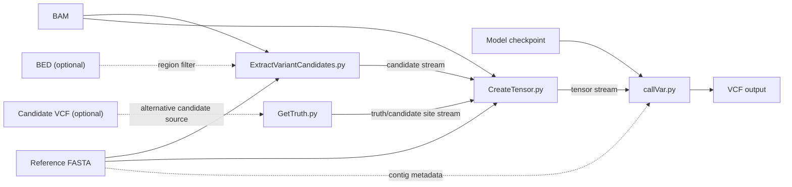
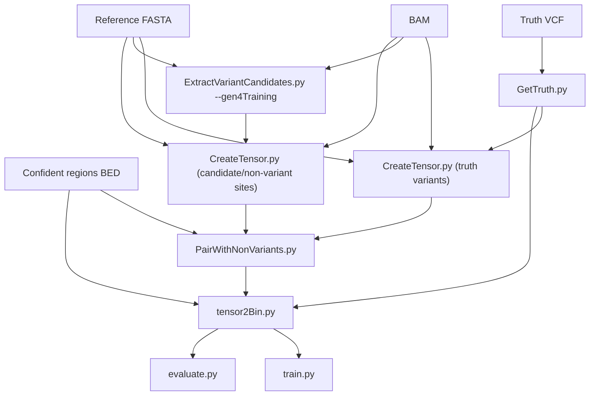

# Data Flow and File Formats

## End-to-End Workflows

Clairvoyante has two main workflows:

- training a model from truth data
- calling variants with a trained model

## Variant Calling from BAM

### Runtime flow



### What each stage emits

| Stage | Output shape |
| --- | --- |
| `ExtractVariantCandidates.py` | One whitespace-delimited candidate record per site. |
| `GetTruth.py` | One simplified truth record per VCF variant. |
| `CreateTensor.py` | One whitespace-delimited tensor record per site. |
| `callVar.py` | VCF 4.1 file with predicted genotype, quality, depth, and allele frequency. |

### Candidate site generation

`ExtractVariantCandidates.py`:

- walks BAM alignments via `samtools view`
- parses CIGAR strings
- maintains an in-memory pileup keyed by reference position
- counts `A/C/G/T/I/D/N`
- emits a site if:
  - coverage is at least `--minCoverage`
  - the leading non-reference evidence passes `--threshold`, or
  - the top observed base disagrees with the reference

For training mode, `--gen4Training` forces broad candidate generation and subsamples output using `--candidates / --genomeSize`.

### Tensor construction

`CreateTensor.py` turns a candidate site into a fixed-shape tensor over a local alignment window.

The tensor shape is:

```text
(2 * flankingBaseNum + 1, 4, matrixNum)
```

With the default parameters:

- `flankingBaseNum = 16`
- `matrixNum = 4`

the default tensor shape is:

```text
(33, 4, 4)
```

The tensor is serialized as one line containing:

```text
<chrom> <pos> <reference_window> <flattened numeric tensor values...>
```

### Tensor channel semantics

The four matrices are not documented as named channels in code comments, but the generation logic in `CreateTensor.py` shows the intent:

| Matrix index | Meaning in practice |
| --- | --- |
| `0` | Reference-aligned support counts. |
| `1` | Insertion-oriented support counts. |
| `2` | Deletion-oriented support counts. |
| `3` | Alternative/base-observation support counts. |

When tensors are loaded by `utils_v2.py`, channels `1..3` are converted into deltas relative to channel `0`.

## Training Data Pipeline

### High-level flow



### Label generation

Labels are built in `utils_v2.py` as a 16-element vector:

| Slice | Meaning | Size |
| --- | --- | --- |
| `0:4` | base change probabilities over `A/C/G/T` | 4 |
| `4:6` | zygosity: `HET/HOM` | 2 |
| `6:10` | variant type: `REF/SNP/INS/DEL` | 4 |
| `10:16` | indel length class: `0/1/2/3/4/>4` | 6 |

For non-variant examples, the label is synthesized directly from the tensor center base and marked as:

- homozygous
- reference
- length `0`

### Pairing variants and non-variants

`PairWithNonVariants.py` performs a simple but important balancing step:

- all truth-variant tensors are included
- non-variant tensors are sampled randomly
- sampling rate is based on `amp * (#truth_variants) / (#usable_non_variants)`

This yields a mixed dataset for supervised learning instead of training only on variant loci.

## Binary Dataset Format

`tensor2Bin.py` produces a Python pickle containing four serialized objects in order:

1. total number of examples
2. compressed tensor blocks
3. compressed label blocks
4. compressed position blocks

Block compression is handled with BLosc. The block size defaults to `500` examples.

This format avoids reparsing gzip text inputs during repeated training and evaluation runs.

## Variant Calling Output

`callVar.py` writes VCF 4.1 and computes:

- `GT` genotype
- `GQ` genotype quality
- `DP` read depth estimated from tensor center counts
- `AF` approximate allele frequency

It also emits:

- `SVTYPE=INS` or `SVTYPE=DEL` for large events represented symbolically
- `LENGUESS=<n>` when indel length had to be inferred from tensor evidence

## Data Interfaces Between Scripts

### Truth record format

Produced by `GetTruth.py`:

```text
<chrom> <pos> <ref> <alt> <gt_allele_1> <gt_allele_2>
```

### Candidate record format

Produced by `ExtractVariantCandidates.py`:

```text
<chrom> <1-based-pos> <ref_base> <depth> <base count pairs...>
```

### Tensor record format

Produced by `CreateTensor.py`:

```text
<chrom> <pos> <reference_window> <flattened_tensor_values...>
```

### Internal key format

Many components index records as:

```text
<chrom>:<pos>
```

or, when the reference window is needed:

```text
<chrom>:<pos>:<reference_window>
```

## Region Handling

Region restriction is implemented in multiple layers:

- `--ctgName`, `--ctgStart`, `--ctgEnd`
- optional BED overlap filtering
- optional VCF-restricted candidate generation for known sites

This means a final dataset or callset is often the intersection of:

- BAM coverage
- contig/range arguments
- BED regions
- optionally VCF-provided sites

## File Naming Conventions Used by the Code

The code does not enforce one global naming scheme, but these patterns appear repeatedly:

- checkpoint prefixes ending in zero-padded epoch numbers
- gzip-compressed text files for candidates, truth, and tensors
- chunked VCF output names from `callVarBamParallel.py`:
  - `<output_prefix>.<chrom>_<start>_<end>.vcf`
