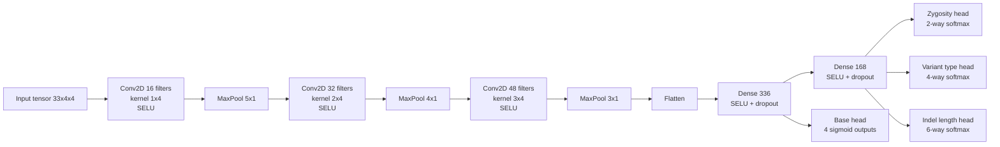
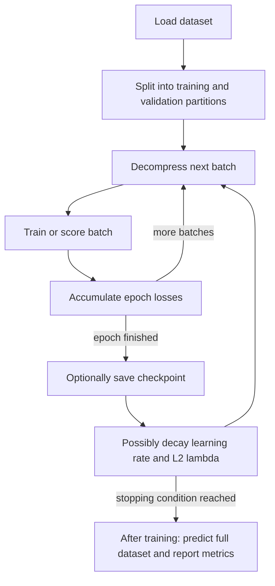

# Model and Training

## Model Family

This repository contains multiple network variants:

- `clairvoyante_v2.py`
- `clairvoyante_v2_slim.py`
- `clairvoyante_v3.py`
- `clairvoyante_v3_slim.py`

The default code path in most scripts enables version 3.

## Prediction Targets

Clairvoyante is a multi-task model. For each candidate site it predicts:

1. base change distribution over `A/C/G/T`
2. zygosity: `HET` or `HOM`
3. variant type: `REF`, `SNP`, `INS`, or `DEL`
4. indel length bucket: `0`, `1`, `2`, `3`, `4`, or `>4`

## Default Input Geometry

The model expects tensors shaped by shared parameters:

```text
flankingBaseNum = 16
matrixNum = 4
input shape = (33, 4, 4)
```

This means:

- 33 reference positions in the local window
- 4 bases per position
- 4 feature matrices per position/base cell

## Version 3 Network Topology

The architecture in `clairvoyante_v3.py` is a five-layer CNN/MLP with multi-head outputs.



### Layer details

| Layer | Default configuration |
| --- | --- |
| Conv1 | 16 filters, kernel `(1,4)` |
| Conv2 | 32 filters, kernel `(2,4)` |
| Conv3 | 48 filters, kernel `(3,4)` |
| FC4 | 336 units |
| FC5 | 168 units |

### Activation and regularization

The implementation uses:

- SELU activations
- custom SELU-compatible dropout from `selu.py`
- L2 regularization on trainable variables excluding biases
- Adam optimizer

## Loss Function

The total loss is the sum of four task losses plus L2 regularization:

```text
loss = base_change_loss
     + zygosity_loss
     + variant_type_loss
     + indel_length_loss
     + l2_loss
```

Where:

- base change uses squared error on the 4-output sigmoid head
- zygosity/type/length use log-softmax cross-entropy

## Training Loop

`train.py` supports two dataset sources:

- raw text tensors and truth labels
- prebuilt binary datasets from `tensor2Bin.py`

### Training process



### Dataset handling

The code keeps the dataset in BLosc-compressed blocks and decompresses batches on demand. This reduces RAM pressure compared with holding the full dense tensor array uncompressed.

### Intended split behavior

The implementation is written to use approximately:

- first 90% of records for training
- last 10% for validation

This split is controlled by `trainingDatasetPercentage` in `clairvoyante/param.py`.

### Learning-rate schedule

Key parameters:

| Parameter | Default |
| --- | --- |
| `initialLearningRate` | `0.001` |
| `learningRateDecay` | `0.1` |
| `maxLearningRateSwitch` | `3` |
| `l2RegularizationLambda` | `0.001` |
| `l2RegularizationLambdaDecay` | `0.1` |

`train.py` uses an adaptive decay heuristic driven by recent validation-loss behavior rather than a fixed epoch schedule.

## Inference Logic

`callVar.py`:

1. restores a checkpoint
2. loads tensors in batches
3. runs prediction asynchronously with threaded overlap between next-batch inference and previous-batch output formatting
4. converts task outputs into VCF records

### How predictions become VCF calls

The caller:

- chooses the most likely variant type
- chooses zygosity from the 2-way head
- chooses indel length bucket from the 6-way head
- reconstructs SNP or indel alleles from the tensor and reference window
- estimates quality using the gap between top and second-best probabilities across heads

## Indel Handling

The model predicts exact indel lengths only up to the trained buckets. The caller then extends this with heuristic inference:

- small indels use predicted length classes directly
- the `>4` class triggers a scan across tensor evidence to estimate longer events
- very long events become symbolic `<INS>` or `<DEL>` alleles

This logic is why VCF output can include:

- `LENGUESS`
- symbolic structural variant alleles

## Evaluation

`evaluate.py` and `evaluateListOfModels.py` compute per-task metrics on labeled tensors:

- base change top-1 and top-2 accuracy
- zygosity confusion matrix
- variant type confusion matrix
- indel length confusion matrix

The evaluation code is task-centric rather than VCF-centric: it scores the neural outputs directly against the encoded label vectors.

## Visualization Tooling

### `getTensorAndLayerPNG.py`

Creates per-example PNGs for:

- input tensor
- conv1 activations
- conv2 activations
- conv3 activations
- fc4 activations
- fc5 activations
- predicted vs truth output vector

### `getEmbedding.py`

Exports TensorBoard projector embeddings for the four task heads:

- base change
- zygosity
- variant type
- indel length

This is useful for inspecting whether the learned representation separates classes cleanly.

## Hyperparameters in Code

The main shared training and runtime defaults live in `clairvoyante/param.py`:

| Setting | Default |
| --- | --- |
| `NUM_THREADS` | `12` |
| `maxEpoch` | `10000` |
| `trainBatchSize` | `10000` |
| `predictBatchSize` | `1000` |
| `dropoutRateFC4` | `0.5` |
| `dropoutRateFC5` | `0.0` |

These defaults are directly consumed by multiple scripts and are part of the effective API of the repository.
